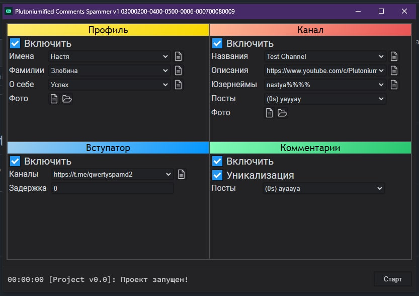
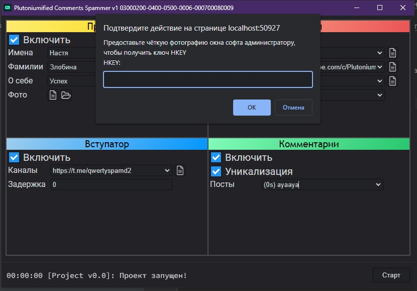
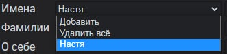

# Plutoniumified - улучшенный спамер в комменты

## Возможности софта
В кратце, софт является небольшим мультитулом или же комбайном, 
включающим в себя **менеджер профиля**, **автоматическое создание каналов**,
а так же 2 главные фичи: **Вступатор** и **спаммер в комментарии**
## Активация
Оплатив софт вы получаете его копию, которую необходимо активировать вместе с администратором.

_**Важно, что одна лицензия = один компьютер!**_

Для активации запускаем программу двойным кликом мыши на main.exe, делаем скриншот окна и отправляем человеку, у которого покупали.

Пример скриншота:

От админа получаете ключ, вставляете его в поле для ввода и нажимете ОК. Готово!

# Инструкция
## Запуск
Первым делом вставляем 1 аккаунт JSON + SESSION в папку data/accounts.
Если нужно: вписываем 1 SOCKS5 прокси в файл data/proxies.txt
## Рандомизированное поле

Небольшое уточнение: большинство полей - рандомизированные dropdown списки. Нажав на перевернутый "треугольник"
можно увидеть 2 дефолтные кнопки: добавить и удалить всё, а ниже ваши значения. Выбрав значение, его можно изменить в поле для ввода
**_однако не важно какое выбрано на момент запуска, софт выберет рандомное из этого списка_**
## Профиль
Менеджер профиля - меняет имя, фамилию, описание и фото профиля на указанные вами.
Добавляете свои имена, фамилии, и фото кнопкой файлика и готово!

**Если не нужно - можно отключить галочкой "Включить"**
## Канал
Схожая с профилем вкладка, создает канал от имени которого аккаунт будет спамить.
Указываем названия, описания, юзернеймы и init-посты (которые будут отправлены при создании канала в него), а так же добавляем фото.

В юзернейме канала можно указать рандомный символ (например, nastya%%% может создать канал с юзернеймом nastyadaw, nastyajhf и другими рандомными символами)

**Если не нужно - можно отключить галочкой "Включить"**
## Вступатор
Для спама в комментарии аккаунт должен быть участником группы. Эта вкладка это и делает.
Добавляем каналы в список "Каналы", ставим задержку между каналами в поле "Задержка" (в секундах)

**Список .txt можно загрузить кнопкой файлика возле поля "Каналы"**

**Если не нужно - можно отключить галочкой "Включить"**
## Комментарии

Уникализация - рандомная замена букв русского алфавита полными аналогами английского алфавита (а - a, В - B, с - c и так далее..)

В результате получается идентичное сообщение для человека, но каждый раз разное для алгоритмов спам-защиты тг.

Посты: добавляем только кнопками Добавить TextPost, ни в коем случае не удаляем часть с задержкой "_(0s)_"
## Markdown
Да
## Запуск 
Запускаем кнопкой старт после включения / отключения нужных функций.
Узнать текущее состояние бота можно в строке снизу. Нажав на нее можно увидеть полный лог действий бота.
При любой ошибке, мешающей работе бота отправляем data/.log админу бота. 
