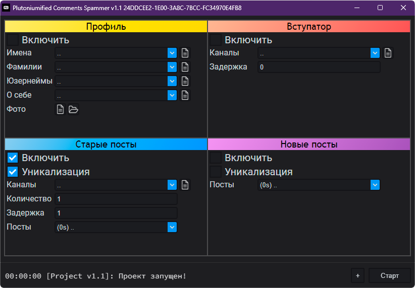
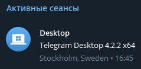

<h1 align="center">
Plutoniumified Comments Spammer
</h1>
<h2 align="center"><a href="https://t.me/telefuckproj">По поводу вопросов и покупки</a>
<h3 align="center">Версия: 1.1</h3>

## Возможности софта
Программа содержит в себе всё, что нужно для спама в комментарии Telegram'а и набора аудитории для ваших проектов.
На фотографии можно увидеть большинство основных возможностей:
- [Автоматическая настройка профиля под спам](https://github.com/plutonium777/enhanced-comments-md#%D0%B0%D0%B2%D1%82%D0%BE%D0%BC%D0%B0%D1%82%D0%B8%D1%87%D0%B5%D1%81%D0%BA%D0%B0%D1%8F-%D0%BD%D0%B0%D1%81%D1%82%D1%80%D0%BE%D0%B9%D0%BA%D0%B0-%D0%BF%D1%80%D0%BE%D1%84%D0%B8%D0%BB%D1%8F-%D0%BF%D0%BE%D0%B4-%D1%81%D0%BF%D0%B0%D0%BC)
- [Автоматическое вступление в каналы для спама](https://github.com/plutonium777/enhanced-comments-md#%D0%B0%D0%B2%D1%82%D0%BE%D0%BC%D0%B0%D1%82%D0%B8%D1%87%D0%B5%D1%81%D0%BA%D0%BE%D0%B5-%D0%B2%D1%81%D1%82%D1%83%D0%BF%D0%BB%D0%B5%D0%BD%D0%B8%D0%B5-%D0%B2-%D0%BA%D0%B0%D0%BD%D0%B0%D0%BB%D1%8B-%D0%B4%D0%BB%D1%8F-%D1%81%D0%BF%D0%B0%D0%BC%D0%B0)
- [Возможность спамить на уже вышедшие посты](https://github.com/plutonium777/enhanced-comments-md#%D0%B2%D0%BE%D0%B7%D0%BC%D0%BE%D0%B6%D0%BD%D0%BE%D1%81%D1%82%D1%8C-%D1%81%D0%BF%D0%B0%D0%BC%D0%B8%D1%82%D1%8C-%D0%BD%D0%B0-%D1%83%D0%B6%D0%B5-%D0%B2%D1%8B%D1%88%D0%B5%D0%B4%D1%88%D0%B8%D0%B5-%D0%BF%D0%BE%D1%81%D1%82%D1%8B-%D1%81%D1%82%D0%B0%D1%80%D1%8B%D0%B5-%D0%BF%D0%BE%D1%81%D1%82%D1%8B)
- [Возможность отвечать одним из первых на новые посты](https://github.com/plutonium777/enhanced-comments-md#%D0%B2%D0%BE%D0%B7%D0%BC%D0%BE%D0%B6%D0%BD%D0%BE%D1%81%D1%82%D1%8C-%D0%BE%D1%82%D0%B2%D0%B5%D1%87%D0%B0%D1%82%D1%8C-%D0%BE%D0%B4%D0%BD%D0%B8%D0%BC-%D0%B8%D0%B7-%D0%BF%D0%B5%D1%80%D0%B2%D1%8B%D1%85-%D0%BD%D0%B0-%D0%BD%D0%BE%D0%B2%D1%8B%D0%B5-%D0%BF%D0%BE%D1%81%D1%82%D1%8B)
- [Разметка (markdown)](https://github.com/plutonium777/enhanced-comments-md#%D1%80%D0%B0%D0%B7%D0%BC%D0%B5%D1%82%D0%BA%D0%B0-markdown)
- [Поддержка прокси](https://github.com/plutonium777/enhanced-comments-md#%D0%BF%D1%80%D0%BE%D0%BA%D1%81%D0%B8-proxyfier)
- [Поддержка разных типов аккаунтов](https://github.com/plutonium777/enhanced-comments-md#%D0%BF%D0%BE%D0%B4%D0%B4%D0%B5%D1%80%D0%B6%D0%BA%D0%B0-%D1%80%D0%B0%D0%B7%D0%BD%D1%8B%D1%85-%D1%82%D0%B8%D0%BF%D0%BE%D0%B2-%D0%B0%D0%BA%D0%BA%D0%B0%D1%83%D0%BD%D1%82%D0%BE%D0%B2)

Нажав на любой из пунктов  можно  увидеть инструкцию по использованию.
## Активация и лицензирование
В данный момент программа платная, цена - $30. 
Оплатив её вы получаете 1 лицензию на 1 компьютер. 
На одном компьютере можно запустить до 25 копий программ с одной лицензии (т.е. спамить с 25 аккаунтов одновременно на одной лицензии)

Распространяется программа .exe файлом.
<h1 align="center">
Инструкция
</h1>

## Автоматическая настройка профиля под спам
Настроив левую верхнюю вкладку с названием "Профиль" можно сделать так, чтобы при запуске спама с аккаунта он менял
- имя
- фамилию
- юзернейм
- о себе (биографию)
- фото

Добавив несколько значений в изменяемое поле или несколько фотографий в папку они будут выбираться случайным образом.

Есть возможность рандомизации имен пользователей: к примеру, введя в поле nastya_%%%, программа сама выберет три последних символа, получится примерно так: @nastya_ksd
## Автоматическое вступление в каналы для спама
Настроив правую верхнюю вкладку с названием "Вступатор" можно сделать так, чтобы при запуске спама с аккаунта он автоматически вступал в указанные каналы.

Добавить список каналов можно нажав на иконку файла возле поля, выбрав затем .txt список каналов.

Так же можно указать задержку между вступлением в каждый канал: выбирать её нужно так, чтобы аккаунт не попадался на Floodwait (защиту от флуд-запросов).
## Возможность спамить на уже вышедшие посты (старые посты)
Одна из лучших возможностей на рынке подобных программ. Позволяет спамить без вступления в каналы. При использовании с аккаунтами от фишинга почти не палится Telegram-ом.

Включив "Уникализацию", можно уникализировать текста заменой символов кирилицы на похожие символы латинского алфавита (русскую а на английскую a и так далее).

Описание полей:
- Каналы - список каналов, в которые по очереди ответит аккаунт.
- Количество - количество постов, отвечать своим комментарием на которые будет бот. Выбрав значение 2 он ответит на последний и предпоследний пост в каждом канале.
- Задержка - задержка между ответами  на посты.

[Так же можно рандомизировать символы / слова (инструкция) и применять разметку](https://github.com/plutonium777/enhanced-comments-md#%D1%80%D0%B0%D0%B7%D0%BC%D0%B5%D1%82%D0%BA%D0%B0-markdown).

## Возможность отвечать одним из первых на новые посты
Основной вид спама в комментарии. Включив его, бот будет отвечать первым или одним из первых на вышедшие посты всех каналов, в которые он вступил через [вступатор]().

Включив "Уникализацию" также можно уникализировать текста заменой символов кирилицы на похожие символы латинского алфавита (русскую а на английскую a и так далее).

Описание полей:
- Посты - текст, которым будем спамить.

[Так же можно рандомизировать символы / слова (инструкция) и применять разметку](https://github.com/plutonium777/enhanced-comments-md#%D1%80%D0%B0%D0%B7%D0%BC%D0%B5%D1%82%D0%BA%D0%B0-markdown).

## Прокси (Proxyfier + TSPP Telegram Spam Proxy Profile)
1. Устанавливаем Proxyfier, активируем его (есть пробный период на месяц)
2. В папке с программой заходим во вложенную папку data, двойным кликом открываем файл TSPP.ppx
3. На вопрос сохранить изменения в старом профиле отвечаем "нет" (Proxyfier может и не спрашивать это)
4. Далее нужно купить и установить свои прокси. Для этого нажимаем Profile -> Proxy Servers -> 144.76.\*\*.58 -> Edit
5. Вводим данные от своих прокси (Address, Port, Protocol и Authentication).
6. Нажимаем Check. Если в появившемся окне нет красного текста, прокси готовы к работе. Нажимаем ОК.
7. Далее жмем ОК пока не окажемся в главном окне программы.
8. Готово! Проверить можно в клиенте Telegram, конфиденциальность -> Сеансы

## Поддержка разных типов аккаунтов
В текущей версии поддерживаются два типа аккаунтов. 
- JSON+SESSION аккаунты (без ввода номера телефона и кода) - их можно загрузить в папку ./data/accounts/
- TData (они же по номеру телефона или с клиента Telegram) - загрузить их можно нажав на "+" возле кнопки "Старт".

## Разметка (Markdown)
Юзернеймы: рандомизированный символ % (пример: nastya_%%% -> nastya_dsj)

Посты: 
- (***X***s) в начале описания вашего поста - это задержка с момента выхода поста. Указывается в секундах. Указав, к примеру, (10s), бот ответит на пост не сразу, а через 10 секунд. 
- Двойной пробел и \n - перенос текста на новую строку.
- сл{ао}во - выбор случайного символа в слове
- Lorem {ipsum|dolor} amet - выбор случайного слова. Слов может быть какое угодно количество.
- \[текст](https://example.com) - ссылка, обернутая в текст.
- \*\*текст** - **жирный текст**
- \_\_текст__ - _курсивный текст_
- \-\-текст-- - подчёрктнутый текст
- \~\~текст~~ - зачёркнутый текст
- ||текст|| - текст под спойлером (скрытый)
- \`текст` - текст, который отображается кодом